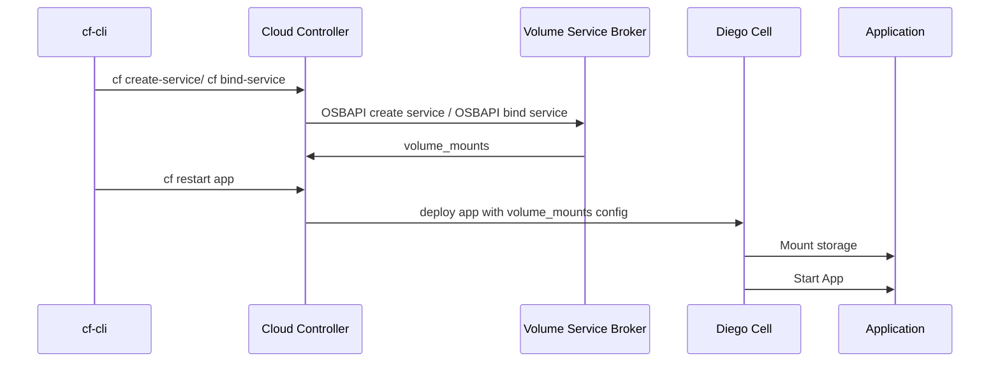
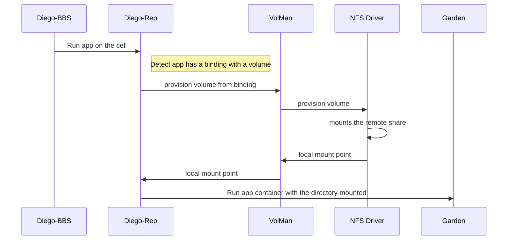

# Overview

Volume services as a product is shipped as part of OSS Cloud Foundry

OSS cloud foundry: OSS Users can choose to install volume-services on their deployment by enabling the deployment of the driver using the ops file, and running the errand to install the broker. The two volume services brokers shipped as part of cf-deployment are nfs broker and smb broker

Application developers consume volume services via the cf services interface.

# Architecture

## Key concepts:

- Service Broker: OSBAPI compliant broker which enables the application developers to list and provision services them selfs.
- Volume Mounts: When a Service Broker binds an application to a service, it can now include an array of volume_mounts, which describe where and how to mount the filesystem in the container.
- Volume Drivers: Volume Drivers are 3rd party plugins which manage the lifecycle of creating, mounting, unmounting, and destroying a Volume Service instance. They are deployed on the Diego cell. More details here

Each volume services deployment contains one service broker component deployed as a CF app, and one driver component deployed as a BOSH release with the Diego cell.

## High level workflow

When a Service Broker binds an application to a service, it can now include an array of volume_mounts, which describe where and how to mount the filesystem in the container.

Before a container starts, the storage device is attached and mounted on the Cell by a trusted component – the Volume Driver – and then bind-mounted into the untrusted container by Garden. This allows storage setup to occur without needing any privilege escalation inside of the container.

## Diego Cell Workflow
This section documents the workflow of what happens internally when the cloud controller asks diego to start an app with a volume attached to it. 

## Volume Drivers

Volume Drivers are 3rd party plugins which manage the lifecycle of creating, mounting, unmounting, and destroying a Volume Service instance. Currently, Volume Drivers written against the Docker v1.12 Volume Plugin specification are supported.

Docker Volume Plugin Docs: [https://docs.docker.com/engine/extend/plugins_volume/](https://docs.docker.com/engine/extend/plugins_volume/)

Drivers are deployed onto Diego Cells in one of two ways. Either they are deployed as colocated jobs, or they are deployed as job-specific add-ons.

Known implementations: 
- [NFS](https://github.com/cloudfoundry-incubator/nfs-volume-release): Support for pre-existing NFS shares is available through the nfs-volume-release. This release allows application developers to provision new service instances corresponding to existing nfs shares, provided that the NFS server is configured to allow connections from the Diego cell VMs in the Cloud Foundry deployment. During application bind, the application developer can specify a UID and GID to be used when connecting to the NFS server.
- [SMB Volume](https://github.com/cloudfoundry/smb-volume-release): A driver and broker that mounts SMB shares.
- [Deprecated][Local Volume](https://github.com/cloudfoundry/local-volume-release): The Diego Persistence team used to maintain a simple reference broker and driver, called the Local Volume Service. The Local Driver only works with single-cell deployments, and is designed to be used as an example in Bosh-Lite. It also serves as a clean example of both a Broker and a Driver
